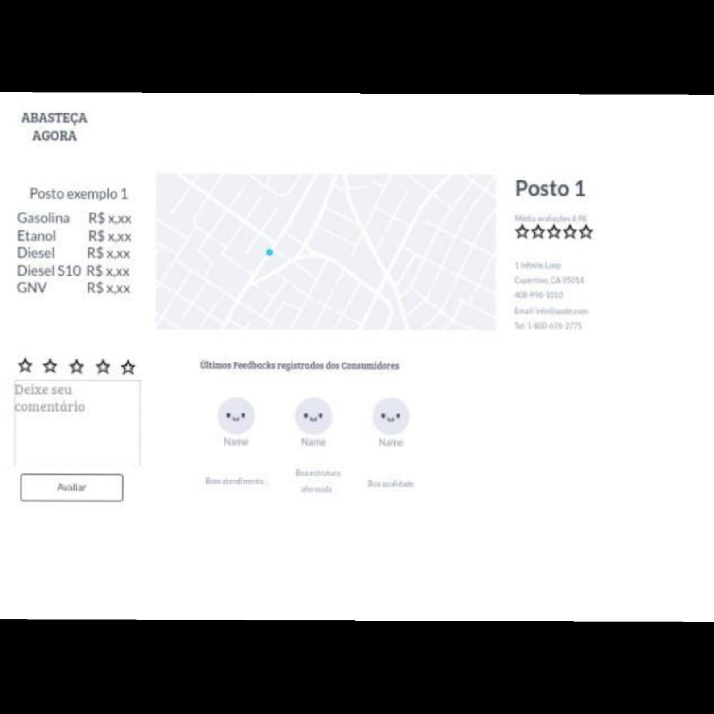
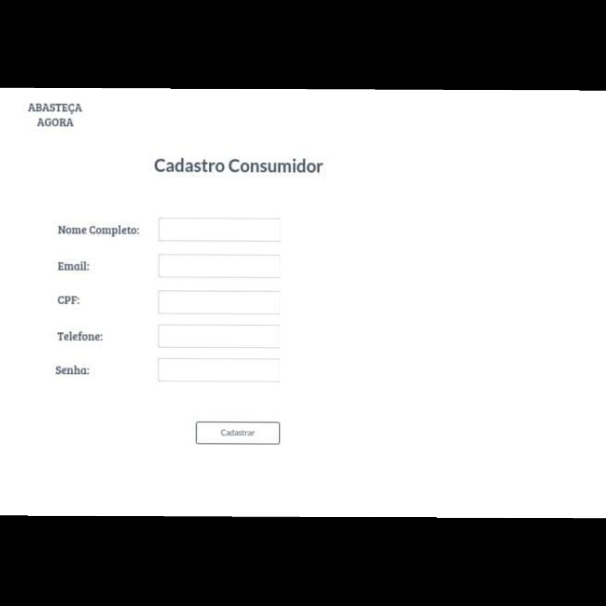
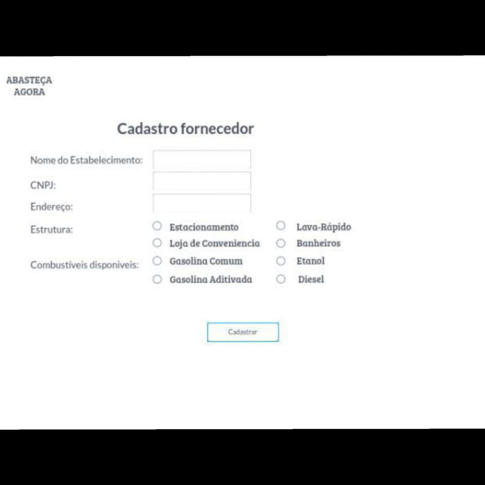

# Projeto de Interface

Dentre as preocupações para a montagem da interface do sistema estabelecemos o foco em questões como: acessibilidade e simplicidade. Desta forma, o projeto tem uma identidade visual padronizada em todas as telas que são projetadas para funcionamento em desktops e dispositivos móveis.

## User Flow

O diagrama apresentado na figura X mostra o fluxo de interação do usuário pelas telas do sistema. Cada uma das telas deste fluxo é detalhada na seção de wireframes que seguinte. Para visualizar o wireframe interativo acesse o http://marvelapp.com/prototype/a6d8hh5.

## Wireframes
Conforme fluxo de telas do projeto, apresentado no item anterior, as telas do sistema são apresentadas em detalhes nos itens seguintes. As telas do sistema apresentam uma estrutura comum que é apresentada na Figura X. Nesta estrutura, existem 4 grandes blocos, descritos a seguir. São eles:

●Header- local onde são dispostos elementos fixos de identidade (logo) e o login);

●Body- apresenta a geolocalização em destaque;

●Sidebar - apresenta o botão sobre a empresa;

●Footer – apresenta o acesso as áreas de cadastros tanto consumidor quanto para fornecedor;

## Tela Home - Page

A tela home-page mostra a área principal do site. Com base na estrutura padrão traz o logo e os acessos ao login, cadastros de consumidores e fornecedores, o API sistema geolocalização utilizada pelo site pra encontrar a localização dos postos e suas informações sobre a empresa.

## Tela Localização do Posto

A tela de localização do posto apresenta o posto localizado e suas informações desde a estrutura, preços do combustível e as últimas avaliações dos consumidores.

## Tela Cadastros

A tela de cadastro dos consumidores e fornecedores será onde consumidores digitam seus dados de e-mail, nome, telefone, CPF e senha para poderem ter acesso a área de consumidor; e o Fornecedor digita dados como endereço completo, CNPJ, Nome do Estabelecimento, estrutura e combustíveis oferecidos pelo posto.

