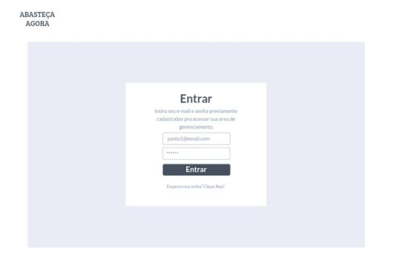
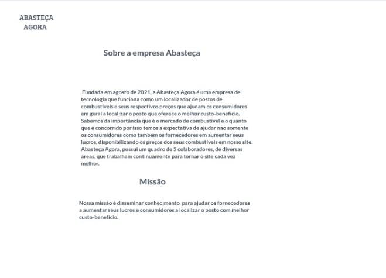

# Projeto de Interface

Dentre as preocupações para a montagem da interface do sistema, definiu-se o foco em questões como: acessibilidade e simplicidade. Desta forma, o projeto tem uma identidade visual padronizada em todas as telas que são projetadas para funcionamento em desktops e dispositivos móveis, ou seja, um site completamente responsivo.

## User Flow
O diagrama apresentado na figura 1 mostra o fluxo de interação do usuário pelas telas do sistema. Cada uma das telas deste fluxo é detalhada na seção de wireframes que seguinte. Para visualizar o wireframe interativo acesse o http://marvelapp.com/prototype/a6d8hh5.

<b>Figura 1 - Fluxo de telas do usuário</b>

## Wireframes
Conforme fluxo de telas do projeto apresentado no item anterior, as telas do sistema são apresentadas em detalhes nos itens seguintes. As telas do sistema apresentam uma estrutura comum que é apresentada na Figura 2. Nesta estrutura, existem 4 grandes blocos, descritos a seguir. São eles:

●Header- local onde são dispostos elementos fixos de identidade (logo) e o login);

●Body- apresenta a geolocalização em destaque;

●Sidebar - apresenta o botão sobre a empresa;

●Footer – apresenta o acesso as áreas de cadastros tanto consumidor quanto para fornecedor;

<b>Figura 2 - Estrutura Padrão do Site</b>

## Tela Home - Page

A tela home-page mostra a área principal do site. Com base na estrutura padrão traz o logo, os acessos ao login, cadastros de consumidores e fornecedores e o API sistema de geolocalização utilizada pelo site pra encontrar a localização dos postos e suas informações sobre a empresa.

<b>Figura 3 - Home Page</b>

## Tela Localização do Posto

A tela de localização do posto apresenta o posto localizado e suas informações desde a estrutura, preços do combustível e as últimas avaliações dos consumidores.

<b>Figura 4 - Localização do Posto</b>

## Tela Cadastros

A tela de cadastro dos consumidores e fornecedores será onde consumidores digitam seus dados de e-mail, nome, telefone, CPF e senha para poderem ter acesso a área de consumidor; e o Fornecedor digita dados como endereço completo, CNPJ, Nome do Estabelecimento, estrutura e combustíveis oferecidos pelo posto.

<b>Figura 5 - Cadastro Consumidor</b>

<b>Figura 6 - Cadastro Fornecedor</b>

## Tela Login

A tela de login onde o consumidor ou fornecedor digitam seus e-mails e senhas para terem acesso as suas respectivas contas de gerenciamento. Caso tenham esquecido sua senha poderá recuperá-las.

<b>Figura 7 - login</b>

## Tela Fornecedor

Na tela de Fornecedor já logado é a área onde os donos dos postos poderão atualizar preços dos combustíveis e efetuar alteração de acesso: senhas, endereços, nome do estabelecimento, além de poder visualizar os feedbacks dos comentários e variação dos preços atualizados por ele nos últimos dias.

<b>Figura 8 - Área do Fornecedor</b>

## Tela Consumidor

Nesta tela do consumidor já logado ele poderá atualizar os seus dados cadastrados e visualizar seus últimos postos pesquisados.

<b>Figura 9 - Área do Consumidor</b>

## Tela Sobre a Empresa

Esta tela conta a história da empresa desde a sua fundação, seus objetivos e missão.

<b>Figura 10 - Sobre a Empresa</b>

