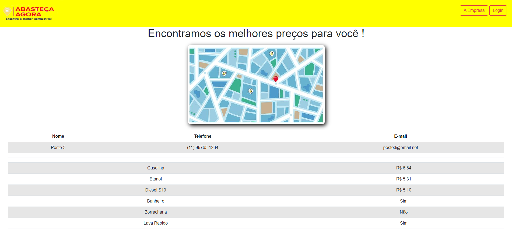
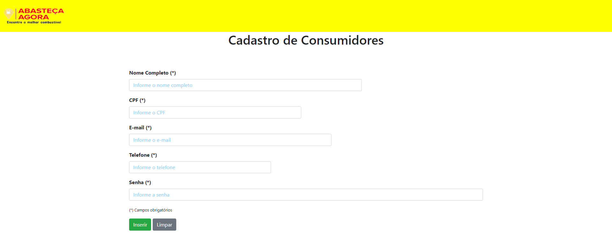
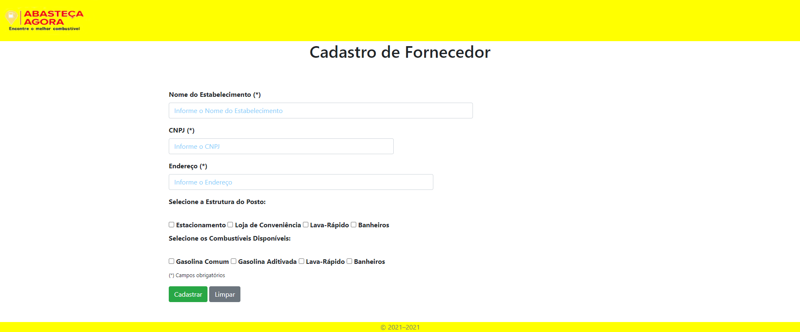
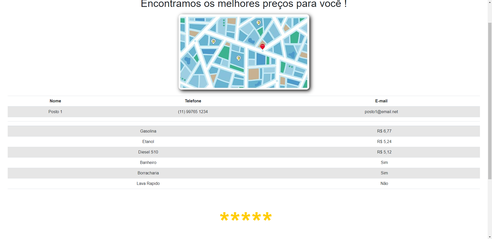
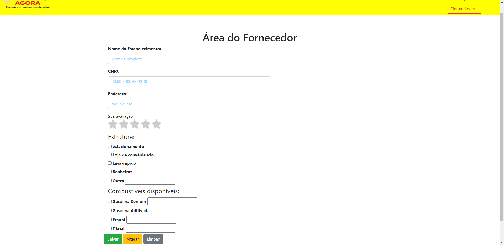

# Registro de Testes de Software

## Teste 01 - Localizar Postos próximos ao meu local

Ao clicar no botão " localizar " o mapa localiza três postos próximos, postos estes que foram previamente cadastrados e avaliados pelos consumidores. Só será possível um consumidor avaliar um posto após se cadastrar no site e logar em sua área.
Ao clicar sobre o posto localizado são carregados os valores, endereço e serviços prestados por cada um dos três postos.

## Teste 02 - Cadastro de Consumidor

No cadastro é preciso informar nome completo, email, telefone e senha. O site armazena corretamente os dados e localiza quando é feito o login.
Consumidores Cadastrados:

Login: joaotransportes@email.com
Senha: abc123

Login: sperandiocamila@email.com
Senha: abc123d

Login: gersasiosanto01@email.net
Senha: abc123abd

## Teste 03 - Cadastro de Fornecedor

Para cadastrar o fornecedor deve se informar razão social, nome fantasia, serviços e valores. O site armazena corretamente os dados e localiza os quando é feito o login.
Fornecedores Cadastrados:

Login: posto1@email.net
Senha: abc123abd

Login: posto2@email.net
Senha: abc123abd

Login: posto3@email.net
Senha: abc123abd

## Teste 04 - Avaliação de Postos

A avaliação é feita por meio de notas de 0 a 5 estrelas ( sendo 5 estrelas: excelente  e 1 estrela: muito ruim ). Só é possivel fazer uma avaliação se o consumidor estiver logado em sua área. O site calcula a média das avaliações recebidas de cada posto e registra.

## Teste 05 - Alteração de dados pelo Fornecedor

Para manter os preços e serviços sempre atualizados é necessário que o fornecedor esteja logado no site e atualize suas informações. O site registra e atualiza corretamente a informação dada pelo fornecedor.

