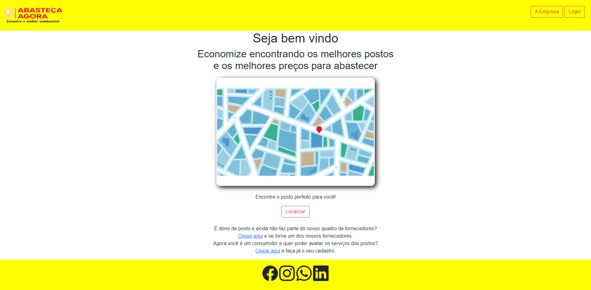

# Registro de Testes de Software

## Teste 01 - Localizar Postos próximos ao meu local

Ao clicar no botão " localizar " o mapa localiza três postos próximos, postos estes que foram previamente cadastrados e avaliados pelos consumidores. Spo será possível um consumidor avaliar um posto só após se cadastrar no site e logar em sua área.

## Teste 02 - Cadastro de Consumidor

No cadastro é preciso informar nome completo, email, telefone e senha. O site armazena corretamento os dados e localiza quando é feito o login.

## Teste 03 - Cadastro de Fornecedor

Para cadastrar o fornecedor deve se informar razão social, nome fantasia, serviços e valores. O site armazena corretamente os dados e localiza os quand é feito o login.

## Avaliação

